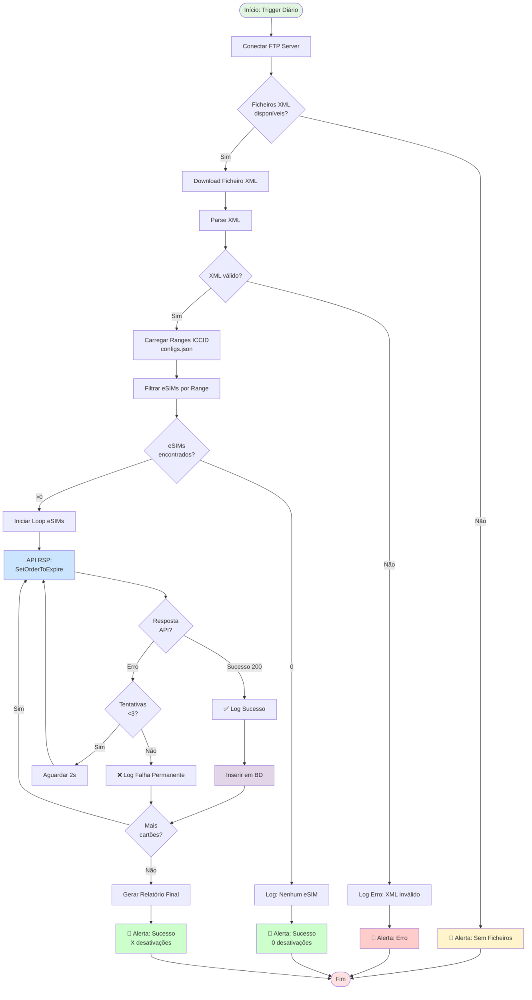

# Desativação de Cartões eSIM - RSP (Remote SIM Provisioning)


Processo RPA que sincroniza o estado de cartões eSIM entre o **NGIN/Siebel** e a plataforma **RSP**, garantindo a desativação automática via API com integridade e rastreabilidade.

---

## 📋 Índice

- [Overview](#-overview)
- [Arquitetura](#-arquitetura)
- [Fluxo BPMN](#-fluxo-bpmn)
- [Requisitos](#-requisitos)
- [Configuração](#%EF%B8%8F-configuração)
- [Instalação](#-instalação)
- [Execução](#%EF%B8%8F-execução)
- [Monitoring &amp; Alertas](#-monitoring--alertas)
- [Troubleshooting](#-troubleshooting)
- [Testes](#-testes)
- [Segurança](#-segurança)
- [Contribuição](#-contribuição)

---

## 🎯 Overview

### Contexto de Negócio

O NGIN/Siebel gera diariamente ficheiros XML com cartões a desativar. Este processo identifica automaticamente **cartões eSIM** (baseado em ranges ICCID) e efetua a desativação na plataforma RSP via API.

### Problema Resolvido

- ✅ Sincronização automática de estados (NGIN → RSP)
- ✅ Redução de intervenção manual (5-10 eSIMs/dia identificados automaticamente)
- ✅ Auditoria completa com logs estruturados
- ✅ Alertas proativos via email

### Métricas Típicas

| Métrica          | Valor                  |
| ----------------- | ---------------------- |
| Frequência       | Diária                |
| Volume processado | ~200 cartões/ficheiro |
| Taxa eSIM         | 1-10 cartões (~5%)    |
| Tempo execução  | <5 min                 |
| Taxa sucesso      | >98%                   |

---

## 🏗️ Arquitetura

### Componentes Principais

```
┌─────────────┐      ┌──────────────┐      ┌─────────────┐
│ NGIN/Siebel │─────>│  FTP Server  │<─────│ RPA Process │
└─────────────┘      └──────────────┘      └──────┬──────┘
                                                  │
                     ┌────────────────────────────┤
                     ▼                            ▼
              ┌─────────────┐              ┌─────────────┐
              │ RSP API     │              │ PostgreSQL  │
              │ (SetOrder   │              │ (Logs/      │
              │  ToExpire)  │              │  Audit)     │
              └─────────────┘              └─────────────┘
                     │
                     ▼
              ┌─────────────┐
              │ Email Alert │
              │ (SMTP)      │
              └─────────────┘
```

### Estrutura de Diretórios

```
DESATIVACAO-ESIM-RSP/
├── configs/
│   ├── .env.example          # Template de configuração
│   ├── config.json           # Ranges ICCID/IMSI (versionado)
│   └── logging.yaml          # Configuração de logs
├── core/
│   ├── orchestrator.py       # Orquestrador principal
│   ├── esim_rsp_client.py    # Cliente API RSP
│   └── business_rules.py     # Lógica de identificação eSIM
├── helpers/
│   ├── database/
│   │   ├── db_manager.py     # Conexão e queries
│   │   └── models.py         # Estrutura de dados
│   ├── ftp_client.py         # Gestão de conexões FTP
│   ├── logger_manager.py     # Logging estruturado
│   ├── email_notifier.py     # Envio de alertas
│   └── validation_utils.py   # Validadores (XML, ICCID)
├── docs/
│   ├── BPMN_process.md       # Diagrama de processo
│   ├── API_RSP_spec.md       # Documentação API
│   └── troubleshooting.md    # Guia de resolução
├── templates/
│   ├── email_success.html    # Template alerta sucesso
│   ├── email_error.html      # Template alerta erro
│   └── email_nofile.html     # Template sem ficheiros
├── tests/
│   ├── unit/                 # Testes unitários
│   ├── integration/          # Testes de integração
│   └── fixtures/             # Dados de teste (XML mock)
├── logs/                     # Logs de execução (gitignored)
├── main.py                   # Entrypoint da aplicação
├── requirements.txt
└── README.md
```

---

## 🔄 Fluxo BPMN

### Diagrama de Processo



### Legenda de Símbolos BPMN

| Símbolo      | Descrição            |
| ------------- | ---------------------- |
| 🟢 Círculo   | Evento de Início/Fim  |
| 🔷 Losango    | Gateway de Decisão    |
| 📦 Retângulo | Tarefa/Atividade       |
| 📧 Envelope   | Envio de Notificação |
| ✅ Check      | Sucesso                |
| ❌ X          | Erro                   |

---

## 🧰 Requisitos

### Software

- **Python**: 3.10 ou superior
- **Sistema Operativo**: Linux (recomendado) / Windows Server
- **Acesso de Rede**:
  - FTP interno (ex.: `CVTPRBSSP4`)
  - API RSP (HTTPS, porta 443)
  - SMTP Server (para alertas)

### Dependências Python

```txt
# requirements.txt (principais)
requests>=2.31.0          # HTTP client para API RSP
xmltodict>=0.13.0         # Parse de ficheiros XML
python-dotenv>=1.0.0      # Gestão de .env
psycopg2-binary>=2.9.9    # PostgreSQL adapter
pydantic>=2.5.0           # Validação de dados
tenacity>=8.2.3           # Retry logic
jinja2>=3.1.2             # Templates de email
```

Instalar com:

```bash
pip install -r requirements.txt
```

---

## ⚙️ Configuração

### 1. Ficheiro `.env` (Credenciais)

**NUNCA commitar este ficheiro!** Usar `configs/.env.example` como base:

```bash
cp configs/.env.example configs/.env
```

**Conteúdo esperado** (`configs/.env`):

```ini
# FTP Configuration
FTP_HOST=192.168.xxx.xxx
FTP_PORT=21
FTP_USER=rpa_user
FTP_PASS=secure_password_here
FTP_PATH=/exports/siebel/deactivations

# RSP API Configuration
RSP_API_BASE=https://rsp.example.com/api/v2
RSP_ACCESS_KEY=your_access_key_here
RSP_SECRET_KEY=your_secret_key_here
RSP_TIMEOUT=30

# Database Configuration
DB_HOST=localhost
DB_PORT=5432
DB_NAME=rpa_esim
DB_USER=rpa_app
DB_PASS=db_password_here

# Email Alerts
SMTP_HOST=smtp.company.com
SMTP_PORT=587
SMTP_USER=alerts@company.com
SMTP_PASS=email_password_here
ALERT_RECIPIENTS=team@company.com,manager@company.com

# Execution Settings
MAX_RETRIES=3
RETRY_DELAY=2
LOG_LEVEL=INFO
```

### 2. Ficheiro `config.json` (Ranges eSIM)

**Versionado no Git** — Define ranges ICCID para identificação de eSIM:

```json
{
  "esim_ranges": [
    {
      "name": "Range A - Provider X",
      "iccid_prefix": "8923800",
      "iccid_start": 89238001000000000,
      "iccid_end": 89238001999999999,
      "enabled": true
    },
    {
      "name": "Range B - Provider Y",
      "iccid_prefix": "8923801",
      "iccid_start": 89238010000000000,
      "iccid_end": 89238019999999999,
      "enabled": true
    }
  ],
  "validation": {
    "iccid_length": 19,
    "require_luhn_check": false
  }
}
```

### 3. Matriz de Ambientes

| Variável            | Desenvolvimento | Produção     |
| -------------------- | --------------- | -------------- |
| `LOG_LEVEL`        | DEBUG           | INFO           |
| `RSP_TIMEOUT`      | 60s             | 30s            |
| `MAX_RETRIES`      | 1               | 3              |
| `ALERT_RECIPIENTS` | dev@company.com | team@,manager@ |

---

## 📦 Instalação

### 1. Clonar Repositório

```bash
git clone <repository_url> DESATIVACAO-ESIM-RSP
cd DESATIVACAO-ESIM-RSP
```

### 2. Criar Ambiente Virtual

```bash
python -m venv .venv

# Linux/Mac
source .venv/bin/activate

# Windows
.\.venv\Scripts\activate
```

### 3. Instalar Dependências

```bash
pip install --upgrade pip
pip install -r requirements.txt
```

### 4. Configurar Variáveis de Ambiente

```bash
cp configs/.env.example configs/.env
# Editar configs/.env com credenciais reais
nano configs/.env
```

### 5. Validar Configuração

```bash
python -c "from core.orchestrator import validate_config; validate_config()"
```

---

## ▶️ Execução

### Modo Manual (Debug)

```bash
python main.py
```

**Output esperado:**

```
[2025-10-21 09:00:01] INFO - Iniciando processo de desativação eSIM
[2025-10-21 09:00:02] INFO - Conectado ao FTP: CVTPRBSSP4
[2025-10-21 09:00:03] INFO - Ficheiro encontrado: deactivations_20251021.xml
[2025-10-21 09:00:04] INFO - Processados 203 cartões, identificados 7 eSIMs
[2025-10-21 09:00:15] INFO - Desativados com sucesso: 7/7
[2025-10-21 09:00:16] INFO - Alerta enviado para: team@company.com
[2025-10-21 09:00:16] INFO - Processo concluído
```

### Modo Produção (Agendado)

#### Linux (Cron)

Editar crontab:

```bash
crontab -e
```

Adicionar linha (execução diária às 09:00):

```cron
0 9 * * * /opt/rpa/DESATIVACAO-ESIM-RSP/.venv/bin/python /opt/rpa/DESATIVACAO-ESIM-RSP/main.py >> /var/log/rpa/esim_rsp.log 2>&1
```

#### Windows (Task Scheduler)

```powershell
$action = New-ScheduledTaskAction -Execute "C:\RPA\DESATIVACAO-ESIM-RSP\.venv\Scripts\python.exe" -Argument "C:\RPA\DESATIVACAO-ESIM-RSP\main.py"
$trigger = New-ScheduledTaskTrigger -Daily -At 9am
Register-ScheduledTask -Action $action -Trigger $trigger -TaskName "eSIM_RSP_Deactivation" -Description "Desativação diária de eSIMs na plataforma RSP"
```

---

## 📊 Monitoring & Alertas

### Sistema de Alertas Email

O processo envia **3 tipos de alertas**:

#### 1️⃣ Sucesso (Template: `email_success.html`)

- **Trigger**: Execução concluída com sucesso
- **Conteúdo**:
  - Total de cartões processados
  - eSIMs identificados e desativados
  - Link para logs detalhados
  - Tempo de execução

#### 2️⃣ Erro (Template: `email_error.html`)

- **Trigger**: Falha crítica (XML inválido, API inacessível, erro DB)
- **Conteúdo**:
  - Tipo de erro
  - Stack trace resumida
  - Cartões afetados
  - Instruções de troubleshooting

#### 3️⃣ Sem Ficheiros (Template: `email_nofile.html`)

- **Trigger**: Nenhum ficheiro XML encontrado no FTP
- **Conteúdo**:
  - Data esperada do ficheiro
  - Path FTP verificado
  - Próxima tentativa agendada

### Estrutura de Logs

```
logs/
├── execution_20251021_090001.log    # Log detalhado da execução
├── errors_20251021.log              # Apenas erros
└── audit_20251021.json              # Formato estruturado para análise
```

**Exemplo de entrada `audit.json`:**

```json
{
  "timestamp": "2025-10-21T09:00:15Z",
  "execution_id": "exec_20251021_090001",
  "status": "success",
  "metrics": {
    "total_cards": 203,
    "esims_identified": 7,
    "esims_deactivated": 7,
    "esims_failed": 0,
    "duration_seconds": 14
  },
  "details": [
    {
      "iccid": "8923800100000001",
      "msisdn_masked": "9389****901",
      "status": "deactivated",
      "rsp_response_code": 200,
      "attempts": 1
    }
  ]
}
```

---

## 🔧 Troubleshooting

### Tabela de Problemas Comuns

| Sintoma                               | Causa Provável                           | Solução                                                                                    |
| ------------------------------------- | ----------------------------------------- | -------------------------------------------------------------------------------------------- |
| `ConnectionError: FTP timeout`      | Firewall ou credenciais inválidas        | Verificar conectividade:`telnet FTP_HOST 21`Validar USER/PASS no `.env`             |
| `XMLParseError: Invalid format`     | Ficheiro corrompido ou formato inesperado | Validar XML manualmente:`xmllint --noout file.xml`Verificar encoding (deve ser UTF-8) |
| `API RSP: 401 Unauthorized`         | ACCESS_KEY ou SECRET_KEY inválidos       | Regenerar chaves no portal RSP``Verificar expiração de tokens                       |
| `API RSP: 429 Too Many Requests`    | Rate limiting excedido                    | Adicionar delay entre requests:`time.sleep(0.5)` entre calls                          |
| `No eSIMs found` (recorrente)       | Ranges desatualizados em `config.json`  | Contactar fornecedor para novos ranges``Verificar logs: padrões ICCID reais          |
| `SMTP Error: Authentication failed` | Credenciais email incorretas ou 2FA ativo | Usar App Password se 2FA ativo``Testar manualmente: `telnet SMTP_HOST 587`          |
| `Database connection refused`       | PostgreSQL não acessível                | Verificar serviço:`systemctl status postgresql`Validar DB_HOST/PORT no `.env`      |

### Comandos de Debug

```bash
# Verificar conectividade FTP
python -c "from helpers.ftp_client import test_connection; test_connection()"

# Testar API RSP (dry-run)
python -c "from core.esim_rsp_client import test_api; test_api()"

# Validar ranges ICCID
python -c "from core.business_rules import validate_ranges; validate_ranges()"

# Gerar relatório de último execution
python scripts/generate_report.py --date 2025-10-21
```

---

## 🧪 Testes

### Estrutura de Testes

```
tests/
├── unit/
│   ├── test_business_rules.py     # Lógica de identificação eSIM
│   ├── test_ftp_client.py         # Mocks de FTP
│   └── test_rsp_client.py         # Mocks de API
├── integration/
│   ├── test_end_to_end.py         # Fluxo completo com fixtures
│   └── test_database.py           # Operações de BD
└── fixtures/
    ├── sample_deactivation.xml    # XML válido
    ├── invalid_format.xml         # XML inválido (teste de erro)
    └── empty_file.xml             # Sem cartões
```

### Executar Testes

```bash
# Todos os testes
pytest tests/ -v

# Apenas unitários (rápido)
pytest tests/unit/ -v

# Com cobertura
pytest --cov=core --cov=helpers tests/

# Teste específico
pytest tests/unit/test_business_rules.py::test_iccid_range_validation
```

### Coverage Target

- **Mínimo aceitável**: 80%
- **Áreas críticas**: 95%+ (`business_rules.py`, `esim_rsp_client.py`)

---

## 🔒 Segurança

### Checklist de Segurança

- ✅ Credenciais em `.env` (nunca no código)
- ✅ `.env` adicionado ao `.gitignore`
- ✅ Logs não expõem MSISDN completo (masking: `9389****901`)
- ✅ Comunicação API via HTTPS (TLS 1.2+)
- ✅ Retry com backoff exponencial (evita sobrecarga)
- ✅ Validação de input (XML schema, ranges ICCID)
- ✅ Segregação de credenciais por ambiente (dev/prod)

### Masking de Dados Sensíveis

```python
# helpers/validation_utils.py
def mask_msisdn(msisdn: str) -> str:
    """Mascara MSISDN para logs (mostra 4 primeiros e 3 últimos dígitos)"""
    if len(msisdn) < 8:
        return "*" * len(msisdn)
    return f"{msisdn[:4]}****{msisdn[-3:]}"

# Exemplo: 938912345 → 9389****345
```

### Auditoria de Acessos

Todos os acessos à API RSP são registados com:

- Timestamp
- Utilizador (do `.env`)
- ICCID processado (hash SHA256 para GDPR compliance)
- Resultado da operação

---

## 🤝 Contribuição

### Git Workflow

#### 1. Branching Strategy

```
main (produção)
  ├── develop (staging)
  │   ├── feature/add-retry-logic
  │   ├── fix/xml-parser-encoding
  │   └── refactor/optimize-db-queries
```

#### 2. Convenção de Commits (Conventional Commits)

```bash
# Features
git commit -m "feat: adicionar suporte a ranges IMSI"

# Correções
git commit -m "fix: corrigir timeout em chamadas API RSP"

# Refactoring
git commit -m "refactor: extrair lógica de parsing XML para helper"

# Documentação
git commit -m "docs: atualizar README com secção de troubleshooting"

# Testes
git commit -m "test: adicionar casos de erro para API client"

# Manutenção
git commit -m "chore: atualizar dependências (requests 2.31.0)"
```

#### 3. Pull Request Checklist

- [ ] Testes passam (`pytest tests/`)
- [ ] Cobertura ≥80% (`pytest --cov`)
- [ ] Linting OK (`ruff check .` ou `flake8`)
- [ ] Documentação atualizada
- [ ] Changelog atualizado (se aplicável)
- [ ] Variáveis sensíveis em `.env` (nunca hardcoded)

### Code Review Guidelines

**Prioridades:**

1. **Segurança**: Exposição de credenciais, injeção SQL
2. **Corretude**: Lógica de negócio (ranges ICCID)
3. **Performance**: Chamadas API em batch vs. loop
4. **Manutenibilidade**: Complexidade ciclomática <10

---

## 📌 Próximos Passos Recomendados

### Curto Prazo (Sprint Atual)

- [ ] Implementar CI/CD (GitHub Actions)
  - Executar testes em PRs
  - Validar linting (ruff/flake8)
  - Deploy automático para staging
- [ ] Adicionar healthcheck endpoint (para monitoring externo)
- [ ] Criar dashboard Grafana (métricas de execução)

### Médio Prazo (Próximo Quarter)

- [ ] Migrar alertas email para Microsoft Teams (webhooks)
- [ ] Implementar processamento em batch na API RSP (reduzir calls)
- [ ] Adicionar reconciliação diária (comparar estados NGIN vs RSP)
- [ ] Criar UI web simples (histórico de execuções)

### Longo Prazo

- [ ] Avaliar migração para arquitetura event-driven (Kafka/RabbitMQ)
- [ ] Implementar machine learning para deteção de anomalias
- [ ] Integração com sistema de ticketing (criar tickets automáticos em falhas)

---

## 📚 Referências

- [Documentação API RSP](docs/API_RSP_spec.md)
- [BPMN 2.0 Standard](https://www.omg.org/spec/BPMN/2.0/)
- [Conventional Commits](https://www.conventionalcommits.org/)
- [Python Logging Best Practices](https://docs.python.org/3/howto/logging.html)

---

## 📞 Contacto & Suporte

**Equipa de Processos e Automação**
Cabo Verde Telecom

- **Email**: rpa-team@cvtelecom.cv
- **Confluence**: [Wiki Interno](https://wiki.company.com/rpa/esim-deactivation)
- **Jira**: Projeto `RPA-ESIM`

---

## 📝 Changelog

### v1.1.0 (2025-10-21)

- ✨ Adicionado diagrama BPMN em Mermaid
- 📚 Secção de troubleshooting expandida
- 🔒 Implementado masking de MSISDN em logs
- 🧪 Cobertura de testes: 85%

### v1.0.0 (2025-09-15)

- 🎉 Release inicial
- ✅ Integração com API RSP
- 📧 Sistema de alertas email
- 🗄️ Persistência em PostgreSQL

---

**Licença**: Uso Interno - Cabo Verde Telecom
**Versão**: 1.2.1
**Última Atualização**: 21 de Outubro de 2025
