# Processo BPMN - Desativação eSIM RSP

**Versão**: 1.0
**Data**: 21 de Outubro de 2025
**Responsável**: Equipa RPA - Cabo Verde Telecom

---

## 📊 Diagrama BPMN Completo

```mermaid
graph TB
    Start([⏰ Início: Trigger Diário<br/>09:00 UTC])

    Start --> Init[🔧 Inicializar Processo<br/>- Carregar .env<br/>- Validar configs<br/>- Setup logging]

    Init --> Connect[🌐 Conectar FTP<br/>Host: CVTPRBSSP4<br/>Timeout: 30s]

    Connect --> ConnSuccess{Conexão<br/>OK?}

    ConnSuccess -->|Timeout/Auth Error| LogConnError[❌ Log Erro Conexão]
    LogConnError --> AlertError1[📧 Alerta: Erro Crítico<br/>Destinatários: team@]
    AlertError1 --> End

    ConnSuccess -->|Sim| ListFiles[📂 Listar Ficheiros XML<br/>Pattern: deactivations_*.xml<br/>Data: hoje]

    ListFiles --> CheckFiles{Ficheiros<br/>encontrados?}

    CheckFiles -->|0 ficheiros| LogNoFile[⚠️ Log: Sem Ficheiros<br/>Verificar geração NGIN]
    LogNoFile --> AlertNoFile[📧 Alerta: Sem Ficheiros<br/>Tipo: Warning]
    AlertNoFile --> End([🏁 Fim])

    CheckFiles -->|≥1 ficheiro| SelectLatest[🎯 Selecionar Mais Recente<br/>Ordenar por timestamp]

    SelectLatest --> Download[⬇️ Download Ficheiro<br/>Encoding: UTF-8<br/>Max size: 10MB]

    Download --> Parse[🔍 Parse XML<br/>Library: xmltodict<br/>Validar schema]

    Parse --> ValidateXML{XML<br/>válido?}

    ValidateXML -->|Erro de formato| LogXMLError[❌ Log: XML Inválido<br/>- Encoding issue?<br/>- Formato inesperado?]
    LogXMLError --> AlertError2[📧 Alerta: Erro Parse XML]
    AlertError2 --> End

    ValidateXML -->|Sim| ExtractCards[📋 Extrair Lista de Cartões<br/>Campo: card_number]

    ExtractCards --> CountTotal[📊 Contar Total<br/>Registar métrica]

    CountTotal --> LoadRanges[⚙️ Carregar Ranges ICCID<br/>Source: configs/config.json<br/>Validar enabled=true]

    LoadRanges --> FilterLoop[🔄 Iniciar Loop de Filtragem]

    FilterLoop --> CheckCard[Verificar ICCID atual]

    CheckCard --> InRange{ICCID dentro<br/>de range<br/>eSIM?}

    InRange -->|Não| NextCardFilter{Mais<br/>cartões?}
    InRange -->|Sim| AddToList[✅ Adicionar a lista eSIM<br/>Guardar metadata]
    AddToList --> NextCardFilter

    NextCardFilter -->|Sim| CheckCard
    NextCardFilter -->|Não| CountESIM{Total eSIMs<br/>identificados?}

    CountESIM -->|0| LogNoESIM[ℹ️ Log: 0 eSIMs<br/>Ficheiro processado]
    LogNoESIM --> AlertSuccess0[📧 Alerta: Sucesso<br/>0 desativações necessárias]
    AlertSuccess0 --> End

    CountESIM -->|1-10| LogESIMFound[📌 Log: X eSIMs encontrados<br/>Preparar desativação]
    CountESIM -->|>10| LogHighVolume[⚠️ Log: Volume Alto<br/>Validar se esperado]

    LogESIMFound --> StartDeactivation[🚀 Iniciar Desativação]
    LogHighVolume --> StartDeactivation

    StartDeactivation --> InitAPI[🔌 Inicializar Cliente RSP<br/>Base URL: RSP_API_BASE<br/>Auth: ACCESS_KEY + SECRET_KEY]

    InitAPI --> LoopESIM[🔁 Loop: Para cada eSIM]

    LoopESIM --> BuildRequest[🛠️ Construir Request<br/>Endpoint: SetOrderToExpire<br/>Payload: ICCID + metadata]

    BuildRequest --> CallAPI[📡 POST API RSP<br/>Timeout: 30s<br/>Headers: Auth]

    CallAPI --> WaitResponse[⏳ Aguardar Resposta]

    WaitResponse --> CheckStatus{HTTP<br/>Status?}

    CheckStatus -->|200 OK| LogSuccess[✅ Log Sucesso<br/>ICCID: XXX desativado<br/>Tempo: Xms]

    LogSuccess --> MaskData[🔒 Mascarar MSISDN<br/>Format: 9389****901]

    MaskData --> DBInsert[💾 Inserir em BD<br/>Tabela: deactivation_audit<br/>Campos: timestamp, iccid_hash,<br/>status, rsp_response]

    DBInsert --> IncrementSuccess[📈 Incrementar contador<br/>success_count++]

    IncrementSuccess --> NextESIM{Mais<br/>eSIMs?}

    CheckStatus -->|401/403| LogAuthError[❌ Auth Error<br/>Verificar chaves RSP]
    LogAuthError --> CheckRetry

    CheckStatus -->|429| LogRateLimit[⚠️ Rate Limit<br/>Aguardar backoff]
    LogRateLimit --> CheckRetry

    CheckStatus -->|500/502/503| LogServerError[❌ Server Error RSP<br/>Erro temporário]
    LogServerError --> CheckRetry

    CheckStatus -->|Timeout| LogTimeout[⏱️ Timeout<br/>Rede lenta?]
    LogTimeout --> CheckRetry

    CheckRetry{Tentativas<br/><3?}

    CheckRetry -->|Sim| IncrementRetry[🔄 Tentativa += 1]
    IncrementRetry --> Wait[⏸️ Aguardar<br/>2s * tentativa<br/>Exponential backoff]
    Wait --> CallAPI

    CheckRetry -->|Não| LogPermanentFail[💥 Falha Permanente<br/>Registar ICCID falhado]

    LogPermanentFail --> IncrementFail[📉 failed_count++]

    IncrementFail --> NextESIM

    NextESIM -->|Sim| LoopESIM
    NextESIM -->|Não| GenerateMetrics[📊 Gerar Métricas Finais<br/>- Total processado<br/>- Sucessos<br/>- Falhas<br/>- Duração]

    GenerateMetrics --> GenerateReport[📄 Gerar Relatório JSON<br/>audit_YYYYMMDD.json]

    GenerateReport --> CheckFailures{Falhas<br/>críticas?}

    CheckFailures -->|Sim >20%| AlertPartialSuccess[📧 Alerta: Sucesso Parcial<br/>Tipo: Warning<br/>Detalhe: X/Y falharam]
    AlertPartialSuccess --> End

    CheckFailures -->|Não| AlertSuccess[📧 Alerta: Sucesso Total<br/>Template: email_success.html<br/>Anexar: relatório resumido]

    AlertSuccess --> CloseFTP[🔌 Fechar Conexão FTP<br/>Cleanup recursos]

    CloseFTP --> CloseDB[💾 Fechar Conexão BD<br/>Commit final]

    CloseDB --> End

    %% Styling
    classDef errorStyle fill:#ffcccc,stroke:#cc0000,stroke-width:2px
    classDef successStyle fill:#ccffcc,stroke:#00cc00,stroke-width:2px
    classDef warningStyle fill:#fff4cc,stroke:#ffaa00,stroke-width:2px
    classDef processStyle fill:#cce5ff,stroke:#0066cc,stroke-width:2px
    classDef dataStyle fill:#e1d5e7,stroke:#9933cc,stroke-width:2px

    class LogConnError,LogXMLError,LogAuthError,LogServerError,LogTimeout,LogPermanentFail errorStyle
    class LogSuccess,AlertSuccess,AlertSuccess0 successStyle
    class LogNoFile,AlertNoFile,LogHighVolume,LogRateLimit,AlertPartialSuccess warningStyle
    class CallAPI,BuildRequest,InitAPI processStyle
    class DBInsert,GenerateReport,MaskData dataStyle
```



---

## 📋 Componentes do Diagrama

### Eventos (Start/End)

| Elemento | Descrição | Trigger |
|----------|-----------|---------|
| **⏰ Início** | Trigger diário agendado | Cron: `0 9 * * *` (09:00 UTC) |
| **🏁 Fim** | Término do processo | Após alerta final ou erro crítico |

### Tarefas (Activities)

#### 1. Inicialização e Conectividade

| Tarefa | Responsável | Duração Típica | Falha Comum |
|--------|-------------|----------------|-------------|
| **Inicializar Processo** | `orchestrator.py` | ~1s | Falta de `.env` |
| **Conectar FTP** | `ftp_client.py` | 2-5s | Firewall / Credenciais |
| **Listar Ficheiros** | `ftp_client.py` | 1-3s | Path incorreto |

#### 2. Processamento de Dados

| Tarefa | Responsável | Complexidade | Validações |
|--------|-------------|--------------|------------|
| **Parse XML** | `validation_utils.py` | O(n) | Schema, Encoding UTF-8 |
| **Extrair Cartões** | `orchestrator.py` | O(n) | Campo `card_number` presente |
| **Filtrar eSIMs** | `business_rules.py` | O(n*m) | m = número de ranges |

**Nota técnica**: Filtro de ranges usa binary search se ranges forem ordenados → O(n*log m)

#### 3. Desativação via API

| Tarefa | Responsável | Timeout | Retry Logic |
|--------|-------------|---------|-------------|
| **Construir Request** | `esim_rsp_client.py` | - | - |
| **POST API RSP** | `esim_rsp_client.py` | 30s | 3 tentativas, backoff 2s/4s/8s |
| **Processar Resposta** | `esim_rsp_client.py` | - | Parsing JSON |

**Payload exemplo**:
```json
{
  "action": "expire",
  "iccid": "8923800100000001",
  "reason": "customer_request",
  "effective_date": "2025-10-21T09:00:00Z"
}
```

**Response esperada (200 OK)**:
```json
{
  "status": "success",
  "iccid": "8923800100000001",
  "order_id": "ORD-20251021-001",
  "expiry_confirmed": true
}
```

#### 4. Persistência e Auditoria

| Tarefa | Responsável | Transação | Índices |
|--------|-------------|-----------|---------|
| **Mascarar Dados** | `validation_utils.py` | - | - |
| **Inserir em BD** | `db_manager.py` | ACID | `idx_iccid_hash`, `idx_timestamp` |
| **Gerar Relatório** | `orchestrator.py` | - | - |

**Schema BD (simplificado)**:
```sql
CREATE TABLE deactivation_audit (
    id SERIAL PRIMARY KEY,
    execution_id VARCHAR(50) NOT NULL,
    timestamp TIMESTAMP DEFAULT NOW(),
    iccid_hash CHAR(64) NOT NULL,  -- SHA256
    msisdn_masked VARCHAR(20),
    status VARCHAR(20),  -- 'success', 'failed', 'retrying'
    rsp_response_code INT,
    attempts INT DEFAULT 1,
    error_message TEXT,
    INDEX idx_execution (execution_id),
    INDEX idx_timestamp (timestamp DESC)
);
```

### Gateways (Decisões)

| Gateway | Tipo | Condições | Prioridade |
|---------|------|-----------|------------|
| **Conexão OK?** | XOR | `status_code == 0` | Alta |
| **Ficheiros encontrados?** | XOR | `len(files) > 0` | Alta |
| **XML válido?** | XOR | Schema validation pass | Alta |
| **ICCID em range?** | XOR | `range.start <= iccid <= range.end` | Média |
| **Total eSIMs?** | XOR | `count == 0` / `1-10` / `>10` | Média |
| **HTTP Status?** | XOR | `200` / `4xx` / `5xx` / `timeout` | Alta |
| **Tentativas <3?** | XOR | `retry_count < MAX_RETRIES` | Alta |
| **Falhas críticas?** | XOR | `failed/total > 0.2` (20%) | Média |

---

## 🎯 Métricas e KPIs

### Performance Metrics

| Métrica | Target | Alerta se |
|---------|--------|-----------|
| **Duração Total** | <5 min | >10 min |
| **API Response Time** | <500ms | >2s |
| **Taxa de Sucesso** | >98% | <95% |
| **Retries Médios** | <1.2 | >2.0 |

### Business Metrics

| Métrica | Descrição | Fonte |
|---------|-----------|-------|
| **Cartões/Dia** | Total processado | XML NGIN |
| **Taxa eSIM** | % eSIM vs total | Calculado |
| **Desativações** | eSIMs desativados com sucesso | API RSP |
| **Backlog** | Ficheiros pendentes | FTP directory |

---

## 🔄 Cenários de Execução

### Cenário 1: Execução Normal (Happy Path)

**Input**: `deactivations_20251021.xml` com 203 cartões, 7 eSIMs
**Fluxo**:
1. ✅ FTP conecta (2s)
2. ✅ XML válido (1s)
3. ✅ 7 eSIMs identificados (0.5s)
4. ✅ 7 desativações bem-sucedidas (7s, ~1s cada)
5. ✅ Dados persistidos (0.5s)
6. ✅ Email sucesso enviado

**Output**:
- Duração: ~14s
- Email: "✅ 7/7 eSIMs desativados com sucesso"
- BD: 7 registos inseridos

---

### Cenário 2: Sem Ficheiros

**Input**: Diretório FTP vazio
**Fluxo**:
1. ✅ FTP conecta (2s)
2. ⚠️ 0 ficheiros encontrados
3. ⚠️ Log warning
4. 📧 Email "Sem ficheiros" enviado

**Output**:
- Duração: ~3s
- Email: "⚠️ Nenhum ficheiro de desativação encontrado para 2025-10-21"
- Próxima execução: Amanhã 09:00

**Ação**: Verificar geração no NGIN/Siebel

---

### Cenário 3: Erro na API RSP (Transiente)

**Input**: `deactivations_20251021.xml` com 5 eSIMs
**Fluxo**:
1. ✅ Processamento normal até API
2. ❌ eSIM #3: HTTP 503 (Server Error)
3. 🔄 Retry 1 após 2s → 503
4. 🔄 Retry 2 após 4s → 503
5. 🔄 Retry 3 após 8s → **200 OK**
6. ✅ Continua para eSIMs #4 e #5

**Output**:
- Duração: ~30s (delays incluídos)
- Email: "✅ 5/5 eSIMs desativados (1 com retries)"
- Métricas: `avg_attempts: 1.4`

---

### Cenário 4: Falha Permanente Parcial

**Input**: `deactivations_20251021.xml` com 10 eSIMs
**Fluxo**:
1. ✅ eSIMs #1-7 desativados
2. ❌ eSIM #8: 401 Unauthorized (3 retries falharam)
3. ❌ eSIM #9: Timeout (3 retries falharam)
4. ✅ eSIM #10 desativado

**Output**:
- Duração: ~45s
- Email: "⚠️ 8/10 eSIMs desativados (2 falharam permanentemente)"
- BD: 10 registos (8 success, 2 failed)
- **Ação manual necessária**: Investigar eSIMs #8 e #9

---

### Cenário 5: XML Corrompido

**Input**: `deactivations_20251021.xml` com encoding inválido
**Fluxo**:
1. ✅ FTP conecta e download
2. ❌ Parse XML falha (UnicodeDecodeError)
3. ❌ Log erro detalhado
4. 📧 Email erro crítico

**Output**:
- Duração: ~4s
- Email: "❌ Erro crítico: XML inválido (encoding issue)"
- Stack trace anexado
- **Ação**: Contactar equipa NGIN para reprocessar ficheiro

---

## 🛡️ Tratamento de Exceções

### Hierarquia de Erros

```python
# helpers/exceptions.py (sugerido)

class ESIMProcessError(Exception):
    """Base exception para este processo"""
    pass

class FTPConnectionError(ESIMProcessError):
    """Erro de conectividade FTP"""
    severity = "CRITICAL"

class XMLParseError(ESIMProcessError):
    """Erro ao processar XML"""
    severity = "CRITICAL"

class RSPAPIError(ESIMProcessError):
    """Erro na comunicação com RSP"""
    severity = "HIGH"

class RSPAuthError(RSPAPIError):
    """Credenciais RSP inválidas"""
    severity = "CRITICAL"

class DatabaseError(ESIMProcessError):
    """Erro de persistência"""
    severity = "HIGH"
```

### Matriz de Recuperação

| Tipo de Erro | Retry? | Rollback? | Alerta | Continuação |
|--------------|--------|-----------|--------|-------------|
| FTP Timeout | Sim (3x) | N/A | Se persistir | Abortar |
| XML Inválido | Não | N/A | Imediato | Abortar |
| API 401/403 | Sim (3x) | Não | Se persistir | Continuar próximo |
| API 429 | Sim (backoff) | Não | Log | Continuar |
| API 500/503 | Sim (3x) | Não | Se persistir | Continuar próximo |
| API Timeout | Sim (3x) | Não | Se persistir | Continuar próximo |
| DB Connection | Sim (3x) | N/A | Imediato | Abortar |
| DB Insert | Não | Sim | Imediato | Continuar (log falha) |

---

## 📧 Templates de Alertas

### Email 1: Sucesso Total

**Subject**: `✅ [RSP] Desativação eSIM - Sucesso (7/7)`

**Body** (HTML):
```html
<h2>Execução Concluída com Sucesso</h2>
<table>
  <tr><td>Data/Hora:</td><td>2025-10-21 09:00:16 UTC</td></tr>
  <tr><td>Ficheiro:</td><td>deactivations_20251021.xml</td></tr>
  <tr><td>Total Cartões:</td><td>203</td></tr>
  <tr><td>eSIMs Identificados:</td><td>7</td></tr>
  <tr><td><strong>eSIMs Desativados:</strong></td><td><strong>7/7 (100%)</strong></td></tr>
  <tr><td>Duração:</td><td>14 segundos</td></tr>
</table>

<h3>Detalhes</h3>
<ul>
  <li>Retries necessários: 0</li>
  <li>Tempo médio API: 487ms</li>
  <li>Logs: <a href="file://logs/execution_20251021_090001.log">Ver detalhes</a></li>
</ul>
```

---

### Email 2: Sucesso Parcial

**Subject**: `⚠️ [RSP] Desativação eSIM - Sucesso Parcial (8/10)`

**Body**:
```html
<h2>Execução Parcialmente Concluída</h2>
<table>
  <tr><td><strong>eSIMs Desativados:</strong></td><td><strong>8/10 (80%)</strong></td></tr>
  <tr><td style="color:red;">Falhas:</td><td>2</td></tr>
</table>

<h3>⚠️ Cartões com Falha</h3>
<table>
  <tr><th>ICCID (masked)</th><th>Erro</th><th>Tentativas</th></tr>
  <tr><td>8923800****0008</td><td>401 Unauthorized</td><td>3</td></tr>
  <tr><td>8923800****0009</td><td>Request Timeout</td><td>3</td></tr>
</table>

<h3>🔧 Ação Necessária</h3>
<p>Verificar:</p>
<ol>
  <li>Credenciais RSP (ACCESS_KEY/SECRET_KEY)</li>
  <li>Conectividade de rede</li>
  <li>Logs detalhados anexados</li>
</ol>
```

---

### Email 3: Erro Crítico

**Subject**: `❌ [RSP] Desativação eSIM - ERRO CRÍTICO`

**Body**:
```html
<h2 style="color:red;">Processo Interrompido - Erro Crítico</h2>
<table>
  <tr><td>Tipo de Erro:</td><td><strong>XMLParseError</strong></td></tr>
  <tr><td>Mensagem:</td><td>UnicodeDecodeError: 'utf-8' codec can't decode byte 0xff</td></tr>
  <tr><td>Ficheiro:</td><td>deactivations_20251021.xml</td></tr>
</table>

<h3>🔍 Stack Trace (resumida)</h3>
<pre>
File "helpers/validation_utils.py", line 42, in parse_xml
  data = xmltodict.parse(content)
File "site-packages/xmltodict.py", line 327, in parse
  ...
</pre>

<h3>🔧 Próximos Passos</h3>
<ol>
  <li>Contactar equipa NGIN/Siebel</li>
  <li>Validar encoding do ficheiro XML (deve ser UTF-8)</li>
  <li>Solicitar reprocessamento</li>
</ol>
```

---

### Email 4: Sem Ficheiros

**Subject**: `⚠️ [RSP] Desativação eSIM - Sem Ficheiros`

**Body**:
```html
<h2>Nenhum Ficheiro Encontrado</h2>
<table>
  <tr><td>Data Esperada:</td><td>2025-10-21</td></tr>
  <tr><td>Path FTP:</td><td>/exports/siebel/deactivations</td></tr>
  <tr><td>Padrão:</td><td>deactivations_20251021*.xml</td></tr>
</table>

<h3>ℹ️ Informação</h3>
<p>Possíveis causas:</p>
<ul>
  <li>Ficheiro ainda não gerado pelo NGIN</li>
  <li>Sem desativações programadas para hoje</li>
  <li>Problema no export do Siebel</li>
</ul>
<p><strong>Próxima execução:</strong> 2025-10-22 09:00 UTC</p>
```

---

## 🔍 Pontos de Instrumentação (Logging)

### Níveis de Log por Etapa

| Etapa | Level | Mensagem Exemplo |
|-------|-------|------------------|
| Início processo | INFO | `[EXEC-001] Processo iniciado - v1.1.0` |
| Conexão FTP | DEBUG | `[FTP] Conectando a CVTPRBSSP4:21...` |
| Conexão OK | INFO | `[FTP] Conectado com sucesso` |
| Ficheiro encontrado | INFO | `[FTP] Ficheiro: deactivations_20251021.xml (2.3 MB)` |
| Parse XML | DEBUG | `[XML] Parsing com xmltodict...` |
| Cartões extraídos | INFO | `[DATA] 203 cartões extraídos` |
| Range loading | DEBUG | `[CONFIG] Carregados 2 ranges eSIM` |
| eSIM identificado | INFO | `[FILTER] eSIM detectado: 8923800****0001` |
| API call | DEBUG | `[API] POST /SetOrderToExpire - ICCID: 8923800****0001` |
| API sucesso | INFO | `[API] ✅ Desativado (200 OK) - 487ms` |
| API erro | WARNING | `[API] ⚠️ Tentativa 1/3 falhou: 503 Server Error` |
| Retry | INFO | `[RETRY] Aguardando 2s antes de retry...` |
| Falha permanente | ERROR | `[API] ❌ Falha permanente após 3 tentativas` |
| DB insert | DEBUG | `[DB] Inserido registro audit ID: 1234` |
| Fim processo | INFO | `[EXEC-001] Concluído - 7/7 sucesso - 14s` |

---

## 📐 Complexidade e Performance

### Análise de Complexidade

| Operação | Complexidade Temporal | Complexidade Espacial | Notas |
|----------|----------------------|----------------------|-------|
| Parse XML | O(n) | O(n) | n = tamanho do ficheiro |
| Filtro eSIM (linear) | O(n*m) | O(k) | m = ranges, k = eSIMs encontrados |
| Filtro eSIM (binary search) | O(n*log m) | O(k) | Se ranges ordenados |
| API calls (sequencial) | O(k) | O(1) | k = eSIMs |
| DB inserts | O(k) | O(1) | Com índices |

### Otimizações Implementadas

1. **Binary Search em Ranges**:
```python
# business_rules.py
def is_esim(iccid: int, ranges: List[Range]) -> bool:
    # Ranges pré-ordenados por start
    left, right = 0, len(ranges) - 1
    while left <= right:
        mid = (left + right) // 2
        if ranges[mid].start <= iccid <= ranges[mid].end:
            return True
        elif iccid < ranges[mid].start:
            right = mid - 1
        else:
            left = mid + 1
    return False
```

2. **Conexão DB Reutilizada**:
```python
# db_manager.py
with DBManager() as db:  # Context manager
    for esim in esims:
        db.insert_audit(esim)  # Mesma conexão
    db.commit()  # Commit único no final
```

3. **Masking em Batch**:
```python
# validation_utils.py
def mask_msisdns(msisdns: List[str]) -> List[str]:
    return [f"{m[:4]}****{m[-3:]}" for m in msisdns]
```

---

## 🎓 Conclusão

Este diagrama BPMN representa um processo RPA **robusto e resiliente** com:

✅ **Tratamento de erros em 5 níveis** (conexão, parse, API, persistência, notificação)
✅ **Retry logic inteligente** (exponential backoff)
✅ **Auditoria completa** (logs + BD + alertas)
✅ **Separação de concerns** (FTP, parsing, API, DB)
✅ **Escalabilidade** (preparado para aumento de volume)

---

**Manutenção**: Rever este documento a cada alteração no fluxo
**Versionamento**: Usar tags Git para sincronizar com código
**Aprovação**: Equipa RPA + Gestão de Processos

---

*Documento gerado automaticamente baseado no README v1.1.0*
